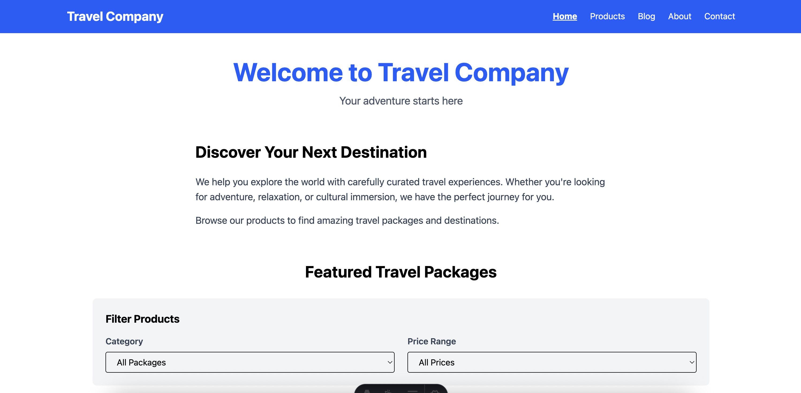

# Travel Company - Astro Starter

A simple, clean starter template for a travel company website built with Astro, React, Tailwind CSS, and Astro DB. This project serves as a foundation for developers to build upon.

## 📸 Screenshot



## 🌟 Features

- **Static Pages**: Home, Products, About, Contact pages with responsive navigation
- **Interactive Components**: React-based product filtering by category and price
- **Blog System**: Dynamic blog powered by Astro DB with article management
- **Modern Styling**: Tailwind CSS v4 for beautiful, responsive design
- **Type-Safe**: Built with TypeScript for better developer experience
- **Server-Side Rendering**: Full SSR support for dynamic content

## 🚀 Quick Start

1. **Install dependencies:**
   ```sh
   npm install
   ```

2. **Setup your .env**
   copy `.env.sample` and make change it to `.env`
   Then add this API Key on one password
   [https://start.1password.com/open/i?a=QVPDF5NMEBB5NDN5W7RTNY2ADA&v=ytrdhc2sgt7zwkjcucedznzlfe&i=bxmr4zsxyfrk6sjrnsrl4g2fkq&h=skyscanner.1password.eu](https://start.1password.com/open/i?a=QVPDF5NMEBB5NDN5W7RTNY2ADA&v=ytrdhc2sgt7zwkjcucedznzlfe&i=bxmr4zsxyfrk6sjrnsrl4g2fkq&h=skyscanner.1password.eu)

3. **Start the development server:**
   ```sh
   npm run dev
   ```
   
   The database will be automatically created and seeded with sample data.

4. **Open your browser:**
   Navigate to `http://localhost:4321`

## 📁 Project Structure

```text
/
├── db/
│   ├── config.ts          # Astro DB schema definitions
│   └── seed.ts            # Sample data for articles
├── public/                # Static assets
├── src/
│   ├── assets/           # Images and other assets
│   ├── components/
│   │   ├── Navigation.astro    # Main navigation component
│   │   └── Products.tsx        # React component with filtering
│   ├── layouts/
│   │   └── Layout.astro        # Base layout template
│   ├── pages/
│   │   ├── index.astro         # Home page
│   │   ├── products.astro      # Products listing page
│   │   ├── about.astro         # About page
│   │   ├── contact.astro       # Contact page with form
│   │   └── blog/
│   │       ├── index.astro     # Blog listing page
│   │       └── [slug].astro    # Dynamic blog post pages
│   └── styles/
│       └── global.css          # Global styles and Tailwind
├── astro.config.mjs       # Astro configuration (SSR mode)
├── package.json
└── tsconfig.json
```

## 🧞 Commands

All commands are run from the root of the project, from a terminal:

| Command                   | Action                                           |
| :------------------------ | :----------------------------------------------- |
| `npm install`             | Installs dependencies                            |
| `npm run dev`             | Starts local dev server at `localhost:4321`      |
| `npm run build`           | Build your production site to `./dist/`          |
| `npm run preview`         | Preview your build locally, before deploying     |

> **Note:** The database is automatically created and seeded each time you run `npm run dev`.

## 📄 Pages Overview

### Home (`/`)
- Welcome message and company introduction
- Featured travel packages with interactive filtering
- Call-to-action to explore products

### Products (`/products`)
- Full product catalog with React-based filtering
- Filter by category (Beach, Mountain, City)
- Filter by price range
- Responsive grid layout

### Blog (`/blog`)
- Article listing page showing all blog posts
- Articles stored in Astro DB
- Category badges and metadata
- Individual article pages at `/blog/[slug]`
- Server-side rendering for dynamic content

### About (`/about`)
- Company story and mission
- Key benefits and value propositions
- Simple, clean layout

### Contact (`/contact`)
- Contact form (HTML-only, no backend)
- Company contact information
- Email, phone, and address details

## 🎨 Styling

This project uses **Tailwind CSS v4** with the Vite plugin. Styles are applied using utility classes throughout the components. Global styles can be found in `src/styles/global.css`.

## 🗄️ Database

The blog system uses **Astro DB** for data storage. The Article table includes:
- Title, slug, excerpt, and full content
- Author and publication date
- Category for filtering
- Optional image URL

The project uses **server-side rendering** (`output: 'server'`), which means all blog posts are fetched dynamically on each request. No static site generation is used for blog pages.

## 🔧 Tech Stack

- **[Astro](https://astro.build)** - Static site generator
- **[React](https://react.dev)** - Interactive UI components
- **[Tailwind CSS](https://tailwindcss.com)** - Utility-first CSS framework
- **[Astro DB](https://docs.astro.build/en/guides/astro-db/)** - Built-in database solution
- **[TypeScript](https://www.typescriptlang.org/)** - Type safety

## 🚀 Building for Production

```sh
npm run build
```

The built site will be in the `./dist/` directory, ready to deploy to your favorite hosting platform.

## 📝 Customization Tips

- **Add more products**: Edit the `products` array in `src/components/Products.tsx`
- **Add blog posts**: Add entries to `db/seed.ts` (database auto-seeds on dev server start)
- **Change styling**: Modify Tailwind classes or add custom CSS in `src/styles/global.css`
- **Add pages**: Create new `.astro` files in `src/pages/`
- **Update navigation**: Edit `src/components/Navigation.astro`

## 👀 Learn More

- [Astro Documentation](https://docs.astro.build)
- [Astro DB Guide](https://docs.astro.build/en/guides/astro-db/)
- [Tailwind CSS Documentation](https://tailwindcss.com/docs)
- [React Documentation](https://react.dev)

---

Built with ❤️ as a starter template for travel companies and beyond.
